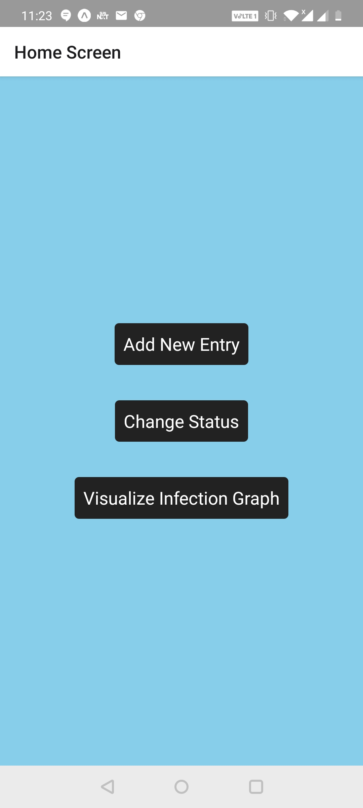
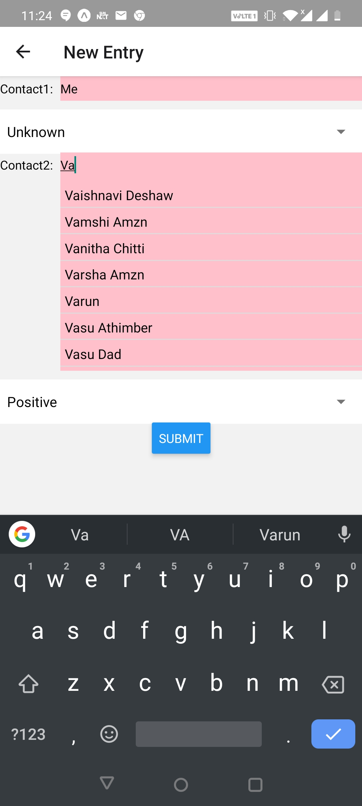
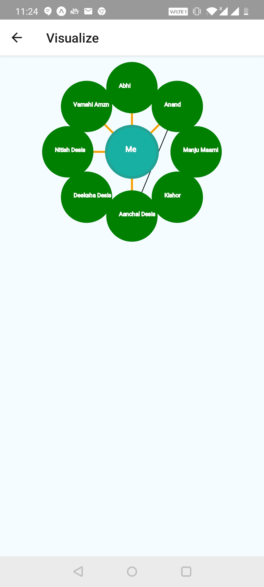
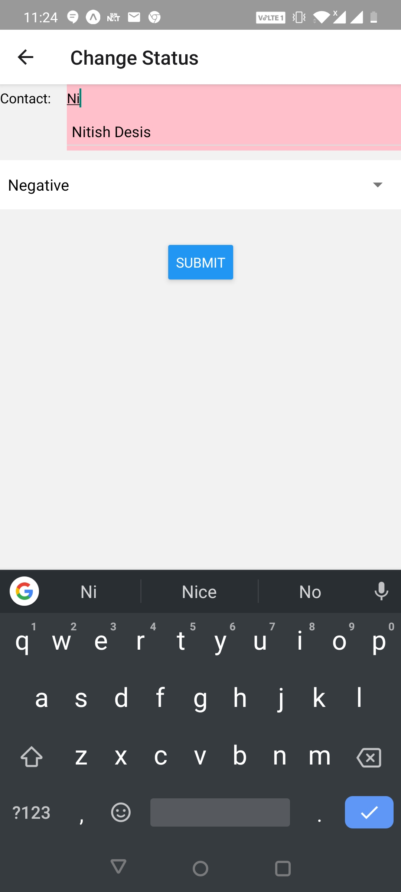

# Cgraph
Track corona infection with local storage

Simple graph tracking for infection, making use of your local storage
of your iphone or android (Since there will be no internet during crisis).

## User Guide

Bear with me till I release it on playstore and istore. 
Till then you can use it on expo app. Here are the steps -  

1. Download the expo App from playstore or istore.
2. Use the following URL to access the App. No need for any signing up since this is just your local ledger. 
`exp://exp.host/@vasudevan/Cgraph`  
3. On Opening the App you would see the splash <b>screen/home screen</b>.
4. There are total 3 screens - Home, New Entry, Visualisation, Change Status. Detailed descriptions of the screen are given below.
### Home Screen
Home Screen is used to access the other screens. 

### New Entry
To add a new entry, lets say you came into contact with "Anand" add the below entry. 
`contact1: Me` (change the status if you know) 
`contact2: Anand` (If you know for sure he is not affected select <b>Negative</b> or is a <b>Positive</b> case else choose <b>Unknown</b>) 

### Visualisation
Since data is boring, you can see the visualisation of the affected people, we make if any connected person is positive we mark the whole connected subgraph as positive.  

### Change Status
You can change the status of the people you have already added to <b>Positive</b>, <b>Negative</b> or <b>Neutral</b>.

## Developer Guide
Do read through the <a href="https://docs.expo.io/versions/latest/">expo documentation</a>, its a non-ejected project and we intend to keep it that way. 
If adding a new package, make sure it works on both android and ios. 
Do test your changes on a physical device apart from the emulator. 
Follow the following steps for setup -  
1. `git clone https://github.com/varunvasudevan94/Cgraph.git`
2. `cd Cgraph`
3. `npm i`
4. `npm start`
5. Either use the emulator or scan the QR code in the expo app in your mobile to get the local changes. Hot loader is available.
6. `expo publish` inorder to publis, you may need to login into your expo account.

You are always welcome for any code changes (PR or suggestions). Its public app so feel free to reuse or distribute (No need even to mention my name just use it).

## Todo
1. Work on CSS
2. Extend to share your personal tracker via bluetooth
